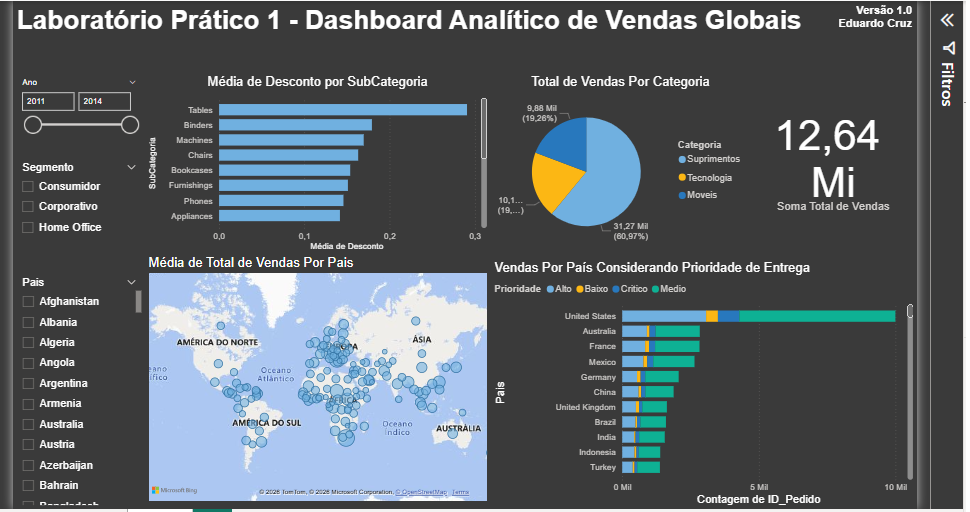

# 📊 Dashboard Analítico de Vendas Globais

## 📌 Visão Geral do Projeto
Este projeto consiste no desenvolvimento de um **Dashboard Analítico de Vendas Globais** baseado em dados de uma empresa fictícia de comércio internacional. O objetivo principal é transformar registros brutos de transações em inteligência operacional e visualizações estratégicas para dar suporte à tomada de decisão gerencial.

Projeto prático desenvolvido durante a formação de Business Intelligence da **Data Science Academy**.

---

## 🛠️ Tecnologias e Ferramentas Utilizadas
* **Microsoft Power BI:** Modelagem de dados, criação de medidas e engenharia de visualização.
* **Power Query:** Extração, limpeza e transformação dos dados (ETL).
* **Linguagem DAX:** Desenvolvimento de métricas calculadas e KPIs de performance.
* **Fontes de Dados:** Arquivos nos formatos `.xlsx` e `.csv` (disponibilizados na raiz deste repositório).

---

## 💼 Desafios de Negócio Resolvidos
O painel foi estruturado para responder a cinco perguntas estratégicas cruciais para a governança da empresa:

1. **Qual o valor total vendido?** (Medido de forma centralizada por cartões de KPI dinâmicos).
2. **Quantas vendas foram realizadas por categoria de produto?** (Visão segmentada para controle de estoque e demanda).
3. **Quantas vendas foram realizadas por país considerando a prioridade de entrega?** (Cruzamento de dados logísticos para entender gargalos de urgência de frete).
4. **Qual foi a média de desconto nas vendas por subcategoria de produto?** (Indicador financeiro para avaliar o impacto das margens e concessões comerciais).
5. **Quais países tiveram maior média de valor de venda?** (Mapeamento demográfico interativo com distribuição geográfica).

---

## ⚙️ Funcionalidades e Recursos de Interatividade
Para garantir uma navegação fluida e exploração autônoma por parte dos gestores, o relatório conta com:
* **Filtros Temporais:** Segmentação completa por Ano.
* **Filtros de Mercado:** Filtro dinâmico por Segmento de cliente.
* **Filtros Geográficos:** Segmentação rápida por País.
* **Narrativa Visual Clara:** Design sóbrio focado em escabilidade e contraste para ambientes corporativos de tomada de decisão rápida.

---

## 📂 Estrutura do Repositório
* `dataset.xlsx` e `dataset.csv`: Bases de dados de vendas brutas utilizadas no projeto.
* `Lab1_Vendas_Globais.pbix`: Arquivo nativo do Power BI Desktop com o modelo de dados e painéis estruturados.
* `README.md`: Documentação técnica do projeto.

---

## 👤 Autor
* **Eduardo Cruz**
* LinkedIn: [eduardo-cruz777](https://linkedin.com)
* Email: edufracruz@gmail.com

